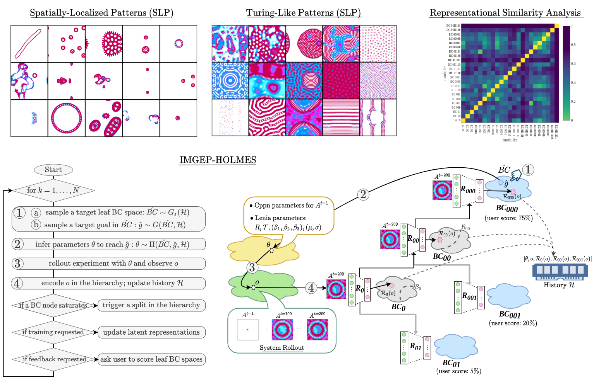

# Hierarchically Organized Latent Modules for Exploratory Search in Morphogenetic Systems

[Project Website](https://mayalene.github.io/holmes/)  




[Mayalen Etcheverry](https://mayalenetcheverry.com/), [Clément Moulin-Frier](http://clement-moulin-frier.github.io/), [Pierre-Yves Oudeyer](http://www.pyoudeyer.com/)  
Flowers Team  
Inria, Univ. Bordeaux, Ensta ParisTech (France)  

This repository hosts the source code to reproduce the results presented in the paper [Hierarchically Organized Latent Modules for Exploratory Search in Morphogenetic Systems](https://arxiv.org/abs/2007.01195).

### Step 0: Installation of the conda environment
1. If you do not already have it, please install [Conda](https://www.anaconda.com/)
2. Create *holmes* conda environment: `conda create --name holmes python=3.6`
3. Activate *holmes* conda environment: `conda activate holmes`
4. Install the required conda packages in the environment (one by one to deal with dependencies errors): `while read requirement; do conda install --yes $requirement --channel default --channel anaconda --channel conda-forge --channel pytorch; done < requirements.txt`
5. Install the required pip packages in the environment (including the provided packages *exputils*, *autodisc* and *goalrepresent*): `pip install -e .`

### Step 1: Reproduce paper results
To reproduce a figure from the paper, please do the following:
```sh
	cd reproduce_paper_figures
	jupyter notebook
```

Then open the notebook corresponding to the figure you want to reproduce and run all the cells.

### Step 2: Reproduce paper experiments

You can find the python code to reproduce all the experiments from the paper (main and supplementary), by going in the **experiments** folder:
> experiments/  
├── IMGEP-BC-BetaVAE  
├── IMGEP-BC-EllipticalFourier  
├── IMGEP-BC-LeniaStatistics  
├── IMGEP-BC-PatchBetaVAE  
├── IMGEP-BC-SpectrumFourier  
├── IMGEP-BetaTCVAE  
├── IMGEP-BetaVAE  
├── IMGEP-BigVAE  
├── IMGEP-HOLMES  
├── IMGEP-HOLMES_no_connection  
├── IMGEP-HOLMES_only_gfi_c  
├── IMGEP-HOLMES_only_lf_c  
├── IMGEP-HOLMES_only_lfi_c  
├── IMGEP-HOLMES_only_recon_c  
├── IMGEP-HOLMES (SLP)  
├── IMGEP-HOLMES (TLP)  
├── IMGEP-SimCLR  
├── IMGEP-TripletCLR  
├── IMGEP-VAE  
└── Random Exploration  

Each folder **IMGEP-X** corresponds to one algorithm variant presented in the paper, and is organized as follow:
> experiments/IMGEP-X/  
├── calc_statistics_over_repetitions.py 
├── calc_statistic_space_representation.py  
├── repetition_000000  
├── repetition_000001  
├── repetition_000002  
├── repetition_000003  
├── repetition_000004  
├── repetition_000005  
├── repetition_000006  
├── repetition_000007  
├── repetition_000008  
├── repetition_000009  
└── **statistics**  

Each subfolder **repetition_00000i** corresponds to one repetition directory (seed=i) for each algorithm variant, and is organized as follow:
> experiments/IMGEP-X/repetition_00000i/  
├── calc_holmes_RSA_per_repetition.py  
├── calc_statistics_per_repetition.py  
├── calc_temporal_holmes_RSA_per_repetition.py  
├── calc_temporal_RSA_per_repetition.py  
├── experiment_config.py  
├── neat_config.cfg  
├── run_experiment.py  
└── **statistics**  


We already provide all the necessary saved results from our experiments in the **statistics** subfolders. The figures of the main paper (Cf **Step 1**) are generated by loading the saved results.

If you wand to regenerate those results, two steps are needed:

1. Run all the individual training experiments. For instance, to run `repetition 0` of `IMGEP-HOLMES` you should do the following:
```sh
	cd experiments/IMGEP-HOLMES/repetition_000000/
	conda activate holmes
	python run_experiment.py
```
2. Run statistics per experiment and/or per repetition, once the training is completed. For instance, for regenerating all the statistics used in IMGEP-HOLMES you should do the following:
```sh
	cd experiments/IMGEP-HOLMES/
	conda activate holmes
	python calc_statistic_space_representation.py
	python calc_statistics_over_repetitions.py 
	cd repetition_000000/
	python calc_holmes_RSA_per_repetition.py
```
**Notice:** Please note that each individual training experiments needs a long time to train (between 20 and 35 hours with one GPU), we therefore recommand to run them if possible on a cluster and in parallel. For this purpose, each python script `<script_name>.py` is accompanied by a `run_<script_name>.slurm` to run the code on a cluster using the [SLURM](https://slurm.schedmd.com/overview.html) job manager.

## Acknowledgement
The *exputils* and *autodisc* packages used in our code builds upon [flowersteam's packages](https://github.com/flowersteam/automated_discovery_of_lenia_patterns) developped by [Chris Reinke](https://www.scirei.net/). 
